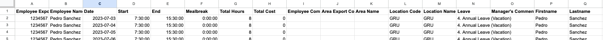

# payroll_report_Deputy_Airtable
## by Alejandra Ramos de Vega
### The code facilitates the calculation of the payroll report using the report with the hours from Deputy, a crucial tool for the operations team. By seamlessly integrating employee data from Airtable, utilized by the performance and people ops teams. This code serves as a monthly automation solution for streamlining the payroll process. 

## Executive Summary 
* [Introduction](#introduction) 
* [Methodology](#Methodology)
* [Results](#results)
* [Upgrates](#upgrates)

## Introduction
[Deputy](https://www.deputy.com/): stands as cloud-based workforce management and scheduling platform designed to help companies organize, track, and manage their teams.  Each month, the system records the worked hours for every employee, as illustrated in the next images. These timesheets are subsequently approve by the respectly managers. The platform allows for the establishment of multiple stores across various cities, catering to diverse operational needs
** All images are sourced from the official Deputy website

To facilitate report exportation, the timesheet offers various options for selection. Users can opt to generate reports for specific time periods, stores, or employees. In this project's context, our focus lies in exporting all hours and employee data for all stores operating within Germany. All these files are downloadable in .csv format, facilitating convenient data manipulation.

## Methodology 
First, lets have a look in the format of the .cvs file from Deputy: 

